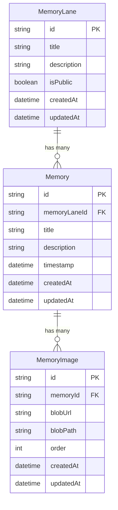

# Memory Lane Take Home for Planned - Gurman Brar

## Tech stack overview

This project is a single **Next.js 16 + TypeScript** application that contains both the client UI and all backend logic. That choice lets us:

- Share types and domain models across the **frontend and backend** (e.g. Prisma types, DTOs).
- Implement **server-side data fetching** and rendering in the App Router, which fits this app well:
  - Lanes and memories are mostly read-heavy, content-like data.
  - SSR gives fast initial page loads, good SEO for public lanes, and a consistent view of auth + privacy (`isPublic`) at the edge.
  - Client components are used only where interactivity is needed (modals, forms, toasts).

For the **UI layer**, we use **shadcn/ui** on top of **Tailwind CSS**:

- shadcn provides a large set of accessible, reusable primitives (cards, dialogs, buttons, inputs, toasts) that we can compose into the Memory Lane UX without reinventing components.
- Tailwind keeps styling consistent and makes it easy to quickly iterate on layout and visual polish.

For **data storage**, we split responsibilities:

- **Relational data** (lanes, memories, images metadata) is modeled with **Prisma** and migrations, backed by a **PostgreSQL** instance.
  - The schema captures natural relationships: `MemoryLane` → `Memory` → `MemoryImage`.
  - Prisma gives strong typing, safe migrations, and good ergonomics for server components.
  - Postgres is a sensible default for an early–mid stage startup: it handles relational queries, future analytics, and schema evolution well, without locking us into a niche vendor.
- **Binary media** (memory images) is stored in **Vercel Blob (S3-like blob storage)**:
  - The frontend uploads files directly to Blob from the browser using signed URLs.
  - The backend stores only blob metadata (`blobUrl`, `blobPath`, `order`) in the `MemoryImage` table, and deletes blobs when memories/images are removed.
  - This keeps the database small and avoids serving large files through the app server.

For **authentication**, we use a simple **JWT-based admin session**:

- There is a single **admin password** (`ADMIN_USER_PASSWORD`); when the user logs in successfully, the server issues a short JWT and stores it in an HTTP-only cookie.
- All mutating routes (`POST/PUT/DELETE` for lanes, memories, images) check this cookie via a shared helper; unauthenticated users get 401s and only see public content.
- This keeps the implementation small (no full user system) while satisfying the requirement that only users with credentials can edit, and it’s easy to evolve into a multi-user auth scheme later if needed.

## Auth model

Authentication is intentionally simple and focused on protecting edits rather than building a full user system:

- A single **environment variable–backed admin password** (`ADMIN_USER_PASSWORD`) controls edit access.
  - When the user submits this password, the server verifies it and, on success, issues a short‑lived JWT.
  - The JWT is stored in an **HTTP-only auth cookie**, which is read on every request that needs to know whether the user is an admin.
- All **CRUD operations** on core entities (memory lanes, memories, memory images) are guarded by this JWT:
  - Route handlers use a shared helper to check the cookie and return `401 Unauthorized` if the token is missing or invalid.
  - Client-side features such as “New memory lane”, “Add memory”, edit/delete buttons, and image editing are only rendered when the admin cookie is present.
- Users **without** the admin cookie are always in **view-only mode**:
  - They can browse public memory lanes and their memories, but never see edit/delete controls and cannot hit any mutating endpoints successfully.
  - This satisfies the requirement that only users with credentials can make changes, while keeping the auth surface area compact and easy to reason about.

## Key features & UX highlights

- **Lane-centric home view**
  - Modern, responsive layout that lists all memory lanes with clear empty states when none exist.
  - Admins can create new lanes via a polished modal and delete lanes inline from the card.

- **Single lane timeline**
  - Each lane renders as a chronological timeline of memories, with a date “rail” and compact cards for each event.
  - Skeleton loaders are shown while data is fetching to avoid jarring layout shifts.

- **Rich memory creation & editing**
  - “Add memory” and “Edit memory” flows use dialogs with client-side validation (react-hook-form + Zod).
  - Users can pick multiple images from their computer; files are uploaded in parallel to Vercel Blob and displayed as ordered thumbnails.
  - Admins can add or remove images on existing memories without leaving the lane page.

- **Clear edit vs view-only modes**
  - Login/logout controls live in the main header; all edit/delete buttons are only visible for authenticated admins.
  - Anonymous visitors always see a clean, read-only experience without accidental destructive actions.

- **Feedback & ergonomics**
  - Toasts (via sonner) provide immediate feedback for all create/update/delete operations.
  - Buttons, cards, and icon controls all show pointer cursors and subtle hover states, making interactive affordances obvious.

## API routes

- **Auth**
  - `POST /api/auth/login` *(admin)* – verify admin password, issue JWT cookie.
  - `POST /api/auth/logout` *(admin)* – clear auth cookie.

- **Memory lanes**
  - `POST /api/memory-lane` *(admin)* – create a new memory lane.
  - `DELETE /api/memory-lane/[id]` *(admin)* – delete a lane and its memories/images.

- **Memories**
  - `POST /api/memory-lane/[id]/memory` *(admin)* – create a memory in a lane.
  - `PATCH /api/memory/[id]` *(admin)* – update memory title/description/timestamp.
  - `DELETE /api/memory/[id]` *(admin)* – delete a memory and its images/blobs.

- **Memory images**
  - `POST /api/memory/[id]/image` *(admin)* – attach a new image to a memory.
  - `DELETE /api/memory-image/[id]` *(admin)* – remove a memory image and its blob.

- **Blob uploads**
  - `POST /api/blob-upload` *(admin)* – sign client-side uploads to Vercel Blob.

## Deployment

The app is deployed on **Vercel**, which is a natural fit for a Next.js project:

- Vercel provides **free, fast deployments** with automatic builds on every push, making it easy to iterate quickly during the take‑home.
- The same platform also hosts our **PostgreSQL database** and **Blob storage**:
  - Postgres powers the Prisma-backed relational data model.
  - Vercel Blob gives us turnkey, globally available object storage for memory images.
- This keeps infrastructure simple and close to the framework, while still being appropriate for an early–mid stage startup that expects to grow beyond a single developer machine.

## Tradeoffs & future work

- **Postgres + Prisma vs NoSQL**
  - Chosen because the domain is naturally relational (lanes → memories → images), we want strong constraints and ordering, and we expect future analytics/reporting. A document store could offer more schema flexibility but at the cost of relational guarantees.

- **Normalized images vs JSONB blobs**
  - A separate `MemoryImage` model keeps ordering, deletion, and blob cleanup explicit and simple. Storing images as a JSONB array on `Memory` would reduce joins but make per-image operations and constraints harder to manage.

- **Simple admin-password auth vs full user system**
  - A single admin secret and JWT cookie keeps the auth surface area very small and matches the requirement “only users with credentials can edit.” The tradeoff is no multi-user accounts, roles, or per-user activity; those could be added by introducing a `User` model and session management later.

- **Client-side Blob uploads vs server-side uploads**
  - Uploading directly from the browser to Vercel Blob avoids large request bodies to the app server and scales better for media-heavy content. It does introduce a two-step flow (upload, then DB write) with error handling between them, which a pure server-side upload would avoid.

- **Next.js App Router (SSR + server components) vs separate backend**
  - Keeping API routes and UI in one Next.js app accelerates development and allows shared types and SSR filtering (`isPublic`) in one place. In a larger system with multiple clients, we might extract the backend into a separate service and have the Next app consume it as one of several frontends.

## Data model

The core relational data is modeled with three entities: `MemoryLane`, `Memory`, and `MemoryImage`.

This mirrors the Prisma schema:
- A **memory lane** is the top-level timeline container.
- Each **memory** belongs to a lane and represents a single chronological event.
- Each **memory image** belongs to a memory and stores the metadata needed to render media from Vercel Blob in a specific order.